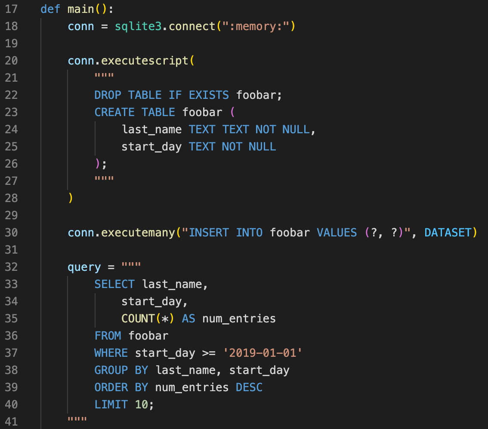

# SQL highlighting in Python multiline strings for VS Code

Adds automatic syntax highlight support SQL strings embedded in Python strings.

**This is still under development,** if you experience issues please try to help us fix them. :)  Auto detecting SQL, and highlighting it properly insight Python is _hard_!

## Community
- 2021-12-13 forked from [python-string-sql](https://github.com/ptweir/python-string-sql)

## Release Notes

### [0.0.1] - 2021-12-13
- Made it so adding `--(begin-)?sql` and `--end-sql` is not necessary!
- Forked from es6-string-html
